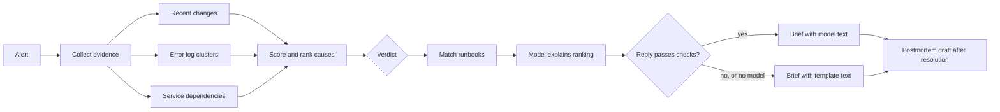

# Incident Response Agent

When an alert fires, the on-call engineer needs three things quickly: what
changed, what the errors say, and what to do first. This agent produces that
as one brief, and drafts the postmortem afterwards.

It is built on one rule: **code gathers and ranks the evidence; the model only
explains it.** The ranking, the verdict and every fact in the brief come from
deterministic code. The model writes the explanation, and each sentence it
writes has to cite evidence that exists. With no model at all, the agent still
produces a complete brief.



## Try it

No API key or network access is needed for any of this.

```bash
pip install -e ".[dev]"

incident-agent investigate samples/incidents/01-bad-deploy
incident-agent postmortem  samples/incidents/01-bad-deploy
incident-agent eval
python -m pytest -q
```

To add the model phase, pick a provider and pin a model:

```bash
pip install -e ".[gemini]"        # or ".[claude]"
export INCIDENT_AGENT_PROVIDER=gemini          # or claude
export INCIDENT_AGENT_MODEL=<exact model id>
export GEMINI_API_KEY=...                      # or ANTHROPIC_API_KEY
incident-agent investigate samples/incidents/03-upstream-outage
```

To read real changes from GitHub, put your repos in `samples/services.json`,
set `GITHUB_TOKEN` to a read-only token, and add `--github`:

```bash
incident-agent github-changes --repo owner/name --hours 48   # see what it would read
```

## What the brief contains

| Section | Written by | Content |
|---|---|---|
| Verdict | Code | `likely_cause`, `possible_causes`, or `no_clear_cause` |
| Ranked hypotheses | Code ranks, model explains | Score, the factors behind it, and the evidence ids it rests on |
| Suggested runbooks | Code | Runbooks matched to the credible hypotheses, with their first steps |
| Proposed actions | Code | What a human could do, and who must approve it. Nothing is executed. |
| Draft status update | Model, or a template | Two or three sentences for stakeholders |
| Evidence | Code | Every fact, numbered, so any claim can be traced |
| Model usage | Code | Tokens, cost, and anything rejected from the model's reply |

## How causes are ranked

Each change that reached production before the signal went bad gets a score
from four factors:

| Factor | Weight | Question |
|---|---|---|
| Timing | 0.35 | How soon before the onset did it go out? Suspicion decays over 45 minutes, or over 6 hours for slow-building problems such as memory. |
| Log overlap | 0.30 | Do the errors name a file this change touched? |
| Topology | 0.25 | Did it change the alerting service, a dependency, or something unrelated? |
| Change risk | 0.10 | Migrations and config changes rank above routine deploys. |

Causes that are not a change (an upstream outage, an expired certificate,
memory or disk exhaustion, a rate limit, database locks, DNS) are detected by
pattern rules over the error clusters and compete in the same ranking. When a
symptom fits a change, such as lock errors alongside a migration, the change
is corroborated instead of competing with it.

A change to an unrelated service can never rank above "low", however recent.

## What the model may and may not do

| The model may | The model may not |
|---|---|
| Explain a hypothesis in plain language | Add a cause that code did not rank |
| Suggest what to check next | Cite evidence that does not exist |
| Reorder hypotheses within the same confidence band | Move a hypothesis across bands |
| Draft the status update | Name a "root cause" unless the verdict is `likely_cause` |

Each rule is enforced by a check on the model's reply, not by the prompt.
Anything that fails is dropped, listed under "Model usage", and replaced by
template text. Logs, commit messages and ticket text reach the model inside a
block marked as untrusted data.

## Results on the sample incidents

`incident-agent eval` runs all eight sample incidents, whose true cause is
recorded in each `truth.json`. With no model:

| Metric | Result |
|---|---|
| True cause ranked first | 7 of 8 |
| False blame (called a change the likely cause when it was not) | 0 of 8 |
| Correct runbook suggested first | 7 of 8 |

The miss is `08-traffic-surge`: an organic traffic spike 12 minutes after a
harmless deploy. The agent leads with the deploy at medium confidence, says
`possible_causes`, and proposes no action. It does not know about traffic
because nothing feeds it traffic data yet.

Read these numbers as a demonstration of the method, not as a measure of
accuracy. I wrote both the incidents and the scoring, and eight cases is a
small set. The eval is there so you can replace the samples with your own
incident history and get a number you can trust.

## Layout

```
src/incident_agent/
  pipeline.py     the investigation, start to finish
  correlate.py    scores recent changes
  rules.py        non-change causes, from error patterns
  logs.py         groups error lines by signature
  runbooks.py     matches runbooks by tag
  llm.py          model clients, the prompt, and the checks on the reply
  render.py       incident brief and postmortem draft
  evals.py        scoring against known causes
  sources/        fixtures (offline) and GitHub (read-only)
runbooks/         eight example runbooks
samples/          eight incidents and a service map
ci/ci.yml         CI workflow; move it to .github/workflows/
DESIGN.md         design decisions, guardrails and limits
```

## Status and limits

- The model clients for Gemini and Claude are written against their SDKs but
  have not been run against a live model. The model phase is tested with
  scripted replies.
- Alerts and logs come from files. Changes can come from GitHub. Adapters for
  an alerting system and a log store are the next thing to add; see
  `sources/__init__.py` for the two methods to implement.
- The postmortem draft computes the timeline and durations and leaves the
  judgement sections for the incident owner.
- Scoring weights are starting values chosen by hand, not fitted to data.
